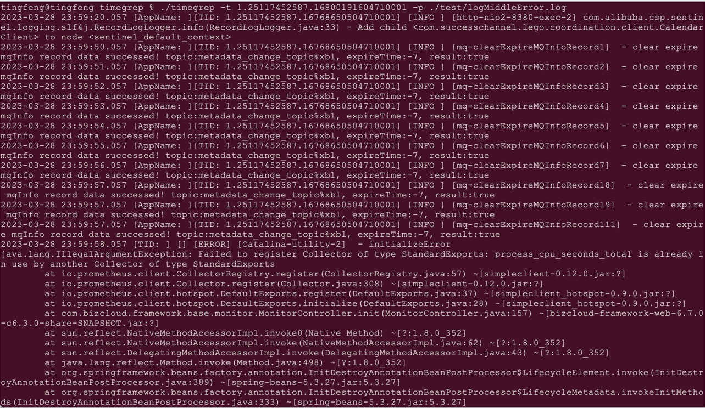
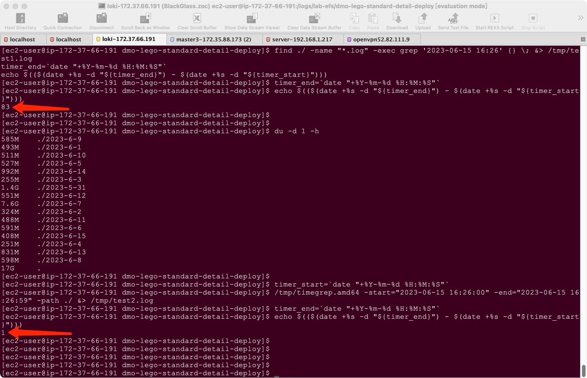

[中文版本](https://github.com/clickpaas/timegrep/blob/main/readme_cn.MD)

# performance grep VS timegrep
timegrep is 80+ times faster than grep with last several minutes scope, 
## timegrep run as following steps
- skip grep old file that modified-date older than search time
- find log-time in log with binary search 
- search result include exception that following log-time
- tid include time , and timegrep will search time between (-15seconds-->+300seconds) 
# usage:
```
Usage1: timegrep -s startTime -e endTime -p pathOrFile
Usage2: timegrep -t tid -p pathOrFile
Usage3: timegrep -t tid1,tid2,tid3 -p pathOrFile

```
# examples:
```
 ./timegrep.amd64 -s "2023-03-28 23:59:55" -e "2023-03-28 23:59:57" -p ./
 ./timegrep.amd64 -s "2023-03-28 23:59:55" -e "2023-03-28 23:59:57" -p ./test/a.log
 ./timegrep.amd64 -t 1.25117452587.16800191604710001 -p ./test/logSimple.log
 ./timegrep.amd64 -t 1.25117452587.16800191604710001,1.25117452587.16800191704710001 -p ./test/logSimple.log
 ./timegrep.amd64 -t 1d25117452587d16800191604710001 -p ./test/logSimpleWithoutDot.log
 ./timegrep.amd64 -t 1d25117452587d16800191604710001,1d25117452587d16800191704710001 -p ./test/logSimpleWithoutDot.log
```




# build
- linux `GOOS=linux GOARCH=amd64 CGO_ENABLED=0 go build -o timegrep.amd64`
- arm64v8 `GOOS=linux GOARCH=arm64 CGO_ENABLED=0 go build -o timegrep.arm64`
- macos `go build`
# TODO:
0. support several log format
1. read first line to select a format layout
2. replace scanner.Text() with scanner.Bytes()
3. performance tuning1: when time is near last log-line, prefer search tail 10000 lines, or search relative line number between first logTime and end logTime 
# (performance PK)  grep VS timegrep 


```
timer_start=`date "+%Y-%m-%d %H:%M:%S"`
find ./ -name "*.log" -exec grep '2023-06-15 16:26' {} \; &> /tmp/test1.log
timer_end=`date "+%Y-%m-%d %H:%M:%S"`
echo $(($(date +%s -d "${timer_end}") - $(date +%s -d "${timer_start}")))

timer_start=`date "+%Y-%m-%d %H:%M:%S"`
./timegrep.amd64 -s="2023-06-15 16:26:00" -e="2023-06-15 16:26:59" -p ./ &> /tmp/test2.log
timer_end=`date "+%Y-%m-%d %H:%M:%S"`
echo $(($(date +%s -d "${timer_end}") - $(date +%s -d "${timer_start}")))
```
